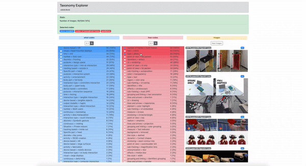
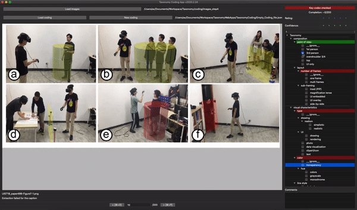

# Interaction Illustration Taxonomy: Classification of Styles and Techniques for Visually Representing Interaction Scenarios

[Axel Antoine](https://axantoine.com/),
[Sylvain Malacria](http://www.malacria.com/),
[Nicolai Marquardt](http://www.nicolaimarquardt.com/) and
[Géry Casiez](https://cristal.univ-lille.fr/~casiez/). 2020

## About
This repository contains the code for the three tools and associated data used to elaborate our taxonomy on interaction illustrations.
Please refer to the publication for more details: [Link to the HAL entry](https://hal.inria.fr/hal-03137867). 

If you use one of these tools or the provided data for acedemic purposes, please cite our paper.

[]( https://doi.org/10.1145/3411764.3445586)

```
@inbook{10.1145/3411764.3445586,
  author = {Antoine, Axel and Malacria, Sylvain and Marquardt, Nicolai and Casiez, G\'{e}ry},
  title = {Interaction Illustration Taxonomy: Classification of Styles and Techniques for Visually Representing Interaction Scenarios},
  year = {2021},
  isbn = {9781450380966},
  publisher = {Association for Computing Machinery},
  address = {New York, NY, USA},
  url = {https://doi.org/10.1145/3411764.3445586},
  booktitle = {Proceedings of the 2021 CHI Conference on Human Factors in Computing Systems},
  articleno = {188},
  numpages = {22}
}
```

## Tools

### Taxonomy Visualisation tool

[](https://ns.inria.fr/loki/taxonomy/TaxonomyVisualisation/)

##### Presentation

This tool proposes two types of visualization for the taxonomy. 

1. A simple expanding tree view, allowing to click on each node of the coding hierarchy.


1. A treemap view, allowing to observe example of figures for each code of the taxonomy and their description. 


##### Installation 

To locally use the tool, you have to host the entire content of this folder on a web server. For that, you can simply run the command `python3 -m http.server` from this folder to run a local server and access the tool through [http://localhost:8000/TaxonomyVisualisation](http://localhost:8000/TaxonomyVisualisation)

### Taxonomy Explorer tool

[](https://ns.inria.fr/loki/taxonomy/TaxonomyExplorer/)

##### Presentation

The Taxonomy Explorer is a web application to navigate through the coded data. Selecting what code and how code items (respectively in the blue and red lists) apply a filter on the data set to get the number of figures with these codes. Both lists can be sorted alphabetically or by percentage, which are updated in real time upon the current codes selection. The right column shows examples of figures containing the selection.



##### Installation 

To locally use the tool, you have to host the entire content of this folder on a web server. For that, you can simply run the command `python3 -m http.server` from this folder to run a local server and access the tool through [http://localhost:8000/TaxonomyExplorer](http://localhost:8000/TaxonomyExplorer)

### Taxonomy coding tool

##### Presentation

The coding tool is developed in PyQt5. It displays one figure at a time and its corresponding caption to help coders understand the displayed figure. On the right side of the app, a tree widget displays the code hierarchy. Hovering a code with the mouse displays a tooltip containing the code description. A checkbox is available for each leaf of the code tree to select or de-select a code for the given figure. Right click on the tree widget to add, remove and rename codes in the hierarchy. 




##### Installation 

To locally use the tool, you need a folder containing images and the empty coding file `TaxonomyCoding/Empty_Coding_file.json`, provided with the python file `TaxonomyCoding/taxonomy_coding_app.py`.

1. Install python 3 and PyQt5 using `brew install PyQt5` (if using Homebrew)
1. Start using `python3 taxonomy_coding_app.py`


## Data

`data/data.json` contains the following dictionaries:

* **what_codes_hierarchies**: hierarchy of **what** codes
* **how_codes_hierarchies**: hierarchy of **how** codes
* **images**: list of coded figures
* **codes**: list of all codes
* **what_codes**: list of all **what** codes
* **how_codes**: list of all **how** codes
* **coding_dict**: coded codes for each figure
* **what_codes_coding_dict**: coded **what** codes for each figure
* **how_codes_coding_dict**: coded **how** codes for each figure
* **images_by_code_dict**: list of coded figures for each code
* **dois_dict**: doi link for each figure
* **captions_dict**: figure caption for each figure


To recreate the images dataset, please follow these steps:

1. Download the proceedings from [CHI'18](https://dl.acm.org/doi/proceedings/10.1145/3173574), [UIST'18](https://dl.acm.org/doi/proceedings/10.1145/3242587), [CSCW'18](https://dl.acm.org/doi/proceedings/10.1145/3272973) and [UbiComp'18](https://dl.acm.org/doi/proceedings/10.1145/3267305) on the ACM website
1. Rename the papers in the format `ConferenceNameYear_paperX.pdf`
1. Extract the images using [pdffigure2](https://github.com/allenai/pdffigures2) and use the following format `ConferenceNameYear_paperX-FigureX-X.png`
1. Use the provided `data/images_structure.json` to sort the extracted images into the right folders.
